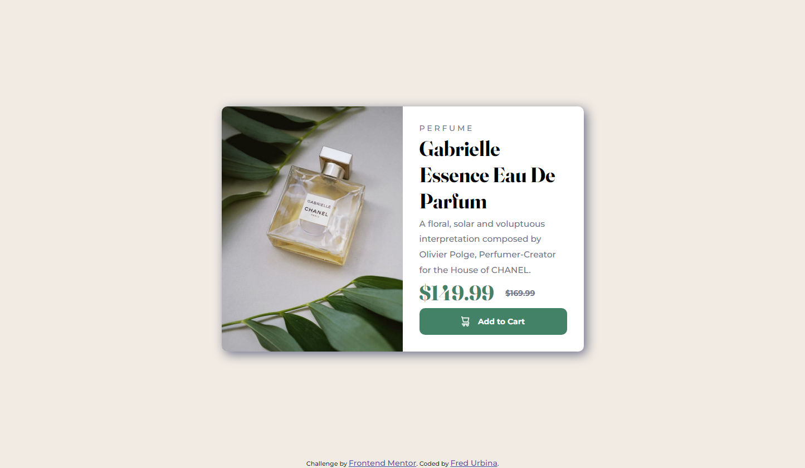
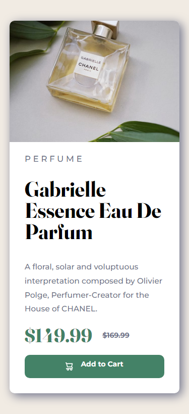

# Frontend Mentor - Product preview card component solution

This is a solution to the [Product preview card component challenge on Frontend Mentor](https://www.frontendmentor.io/challenges/product-preview-card-component-GO7UmttRfa). Frontend Mentor challenges help you improve your coding skills by building realistic projects. 

## Table of contents

- [Overview](#overview)
  - [The challenge](#the-challenge)
  - [Screenshot](#screenshot)
  - [Links](#links)
- [My process](#my-process)
  - [Built with](#built-with)
  - [What I learned](#what-i-learned)
  - [Continued development](#continued-development)
- [Author](#author)

## Overview

### The challenge

Users should be able to:

- View the optimal layout depending on their device's screen size
- See hover and focus states for interactive elements

### Screenshot




### Links

- Live Site URL: [Live Site](https://gartank.github.io/product-preview-card-component/)

- Solution URL: [Solution Site](https://github.com/Gartank/product-preview-card-component)

## My process

### Built with

- Semantic HTML5 markup
- CSS custom properties
- Flexbox
- Desktop-first workflow

### What I learned

This time I relearned how to use image sets and how to make them responsive with HTML only. I think I would solve that with CSS but it was curious to do in HTML.

HTML```
<picture class="product__images">
				<source media="(min-width: 768px)" srcset="images/image-product-desktop.jpg">
				<source media="(min-width: 0px)" srcset="images/image-product-mobile.jpg">
				
```

### Continued development

I'll focus on responsive tools in my futures Projects.

## Author

- GitHub - [@gartank](https://github.com/Gartank/)
- Frontend Mentor - [@yourusername](https://www.frontendmentor.io/profile/Gartanke)
